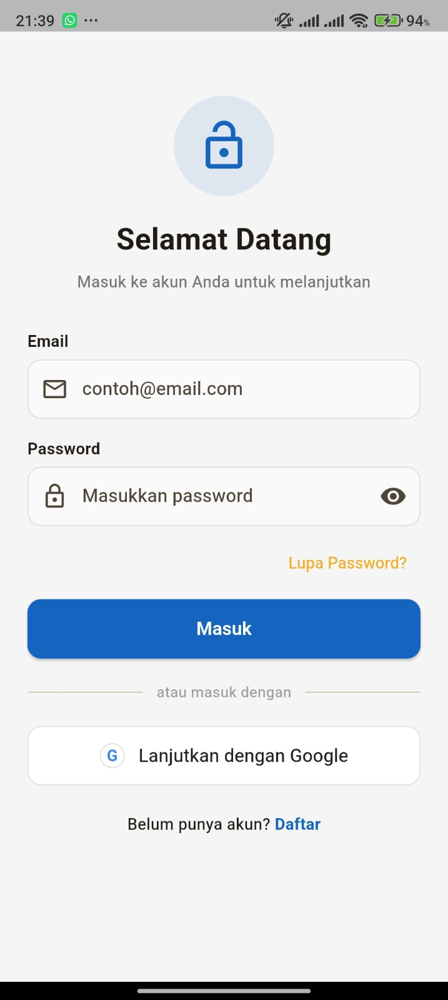
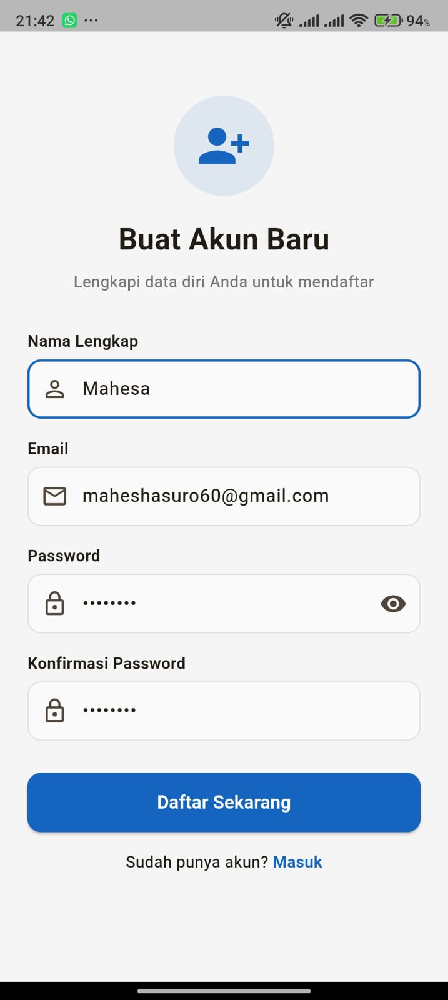
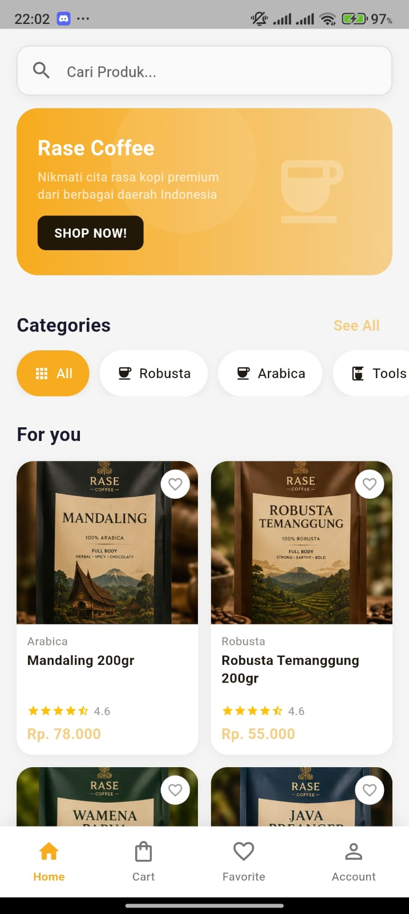
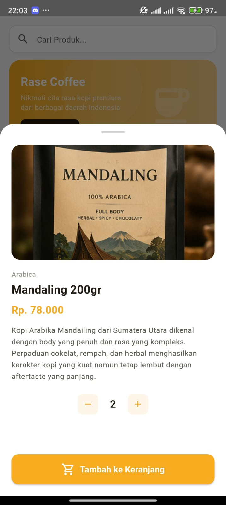
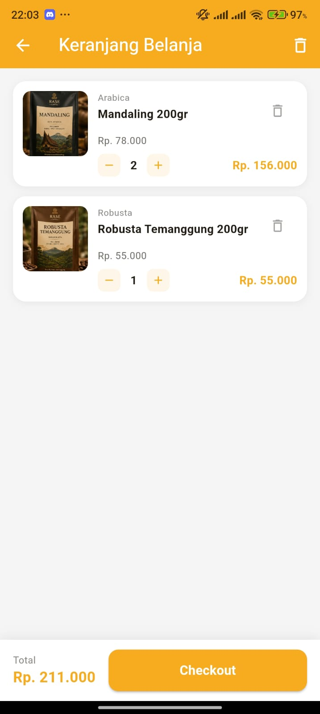
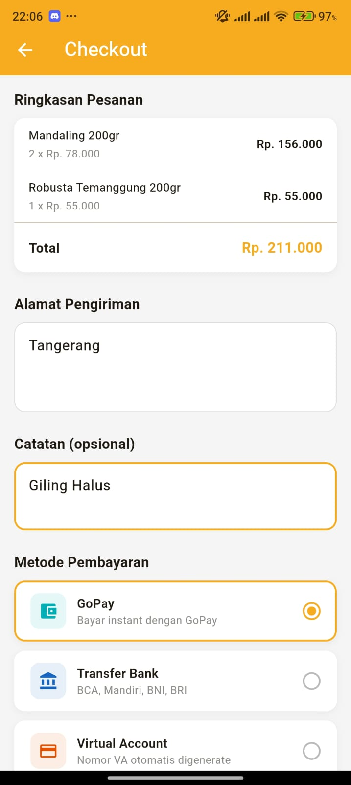

# ☕ UAS Pemrograman Mobile Lanjutan

---

# ☕ Rase Coffee

Rase Coffee merupakan aplikasi katalog dan pemesanan kopi premium khas Indonesia yang dikembangkan sebagai tugas **UAS Pemrograman Mobile Lanjutan**.

Aplikasi ini mengintegrasikan **Flutter** sebagai frontend, **Firebase Authentication** untuk autentikasi pengguna, serta **Backend Golang (Gin Framework)** sebagai REST API yang terhubung dengan **MySQL**.

---

# 🚀 Fitur Utama

- Login & Register
- Verifikasi Email menggunakan Firebase
- Dashboard Produk
- Katalog Kopi
- Keranjang Belanja
- Checkout
- Profil Pengguna

---
## 📱 Login

---

## 📝 Register

---

## ☕ Dashboard

---

## 📦 Detail Produk

---

## 🛒 Keranjang

---

## 💳 Checkout

